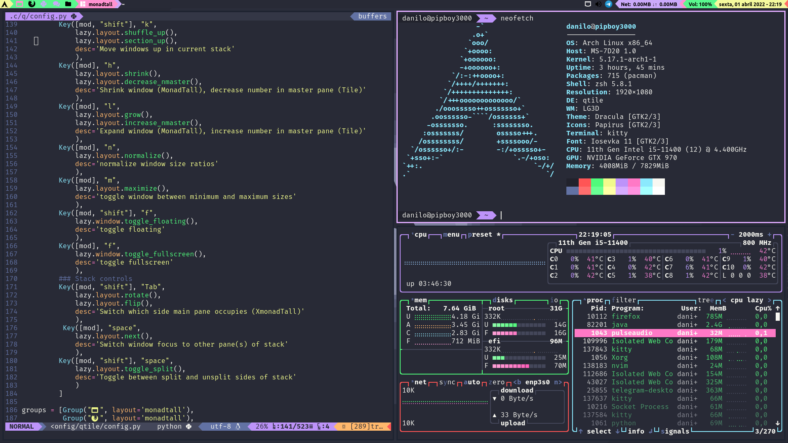

# Arquivos de configurações padrões para minha instalação do Arch



- Tema padrão: Dracula
- Wallpapers: `~/Imagens/Wallpapers`
- Scripts: `~/Scripts`
  -  comp e compon (Liga/desliga o compositor(picom ou xcompmgr) e notifica)
  -  runPasystray (Inicia o tray do pulse audio)
  -  fonttable (Printa todos os caracteres de todas as fontes no terminal)
  -  mymonitor (Muda a configuração de monitores de 4 formas parametrizadas)
  -  screenshot (Tira screenshots de 3 formas parametrizadas)
  -  zeKill (Mire, atire e ele mata o processo)
- Configs para:
  - qTile (Wm) Baseado em: [Source](https://gitlab.com/dwt1/dotfiles)
  - picom (Compositor, fork do jonaburg) [Source](https://github.com/jonaburg/picom)
	- vim/nvim (Editor de texto)
	- zsh (Shell)
	- ranger (Gerenciador de Arquivos)
	- kitty (Emulador de rerminal)
	- paru (AUR manager) [Source](https://github.com/Morganamilo/paru)
	- rofi (Menus) Baseado em: [Source](https://github.com/adi1090x/rofi)
	  - launcher
	  - power menu
	  - menu de monitor

# Instalação

``` bash
$ echo "Em breve?"
```
